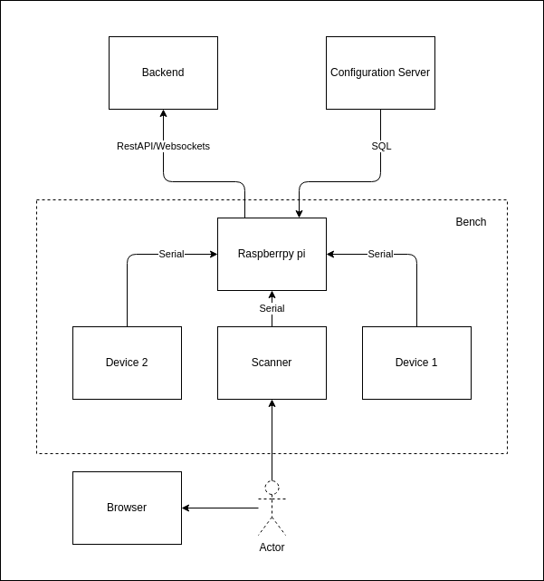

# Magnetization Bench

## Abstract
This project streamlines the magnetization process and coordinates device settings to reduce manual errors and ensure consistency. It also gathers and stores data to optimize sensor performance and aid in product development.

## Tools and Frameworks
- Django channels ( Websockets )
- Django Rest Framework ( RestAPI )
- Javascript
- TailwindCSS
- Python Threading library
- Systemd
- SQL

## Description
The project provides a scalable solution for synchronizing several magnetization devices. Each bench contain a serial scanner and two magnetication devices in addtion to Raspbery pi to coordinate data flow.

## Workflow

When a user scan a Product number, the serial scanner service deployed on Raspberry pi's systemd, will fetch the product configurations using SQL commands and broadcast them through websockets (Django channels) to the two other devices. The magnetization devices are listening to webosckets for any broadcasted configurations using systemd services that is responsible of listening to the new configurations and send Serial packets to the Magnetization devices.

While the magnetization process is running, the devices are providing live updates of the current process status, which will be broadcasted again to the network, and data will be stored to the dataabse. 

The GUI is listening to any updates related to the Product number and showing any live updates on the frontend which enhance process monitoring and error detectablitiy.

## Outcomes and results
This tool achieved the following goals:
- Increase sensor repeatability by 65%
- Reduce human error by 80%
- Increase employee productivity by 30%
- Provide new insights to the sensor internales which helped optimizing sensor perfromance.

## Architecture

